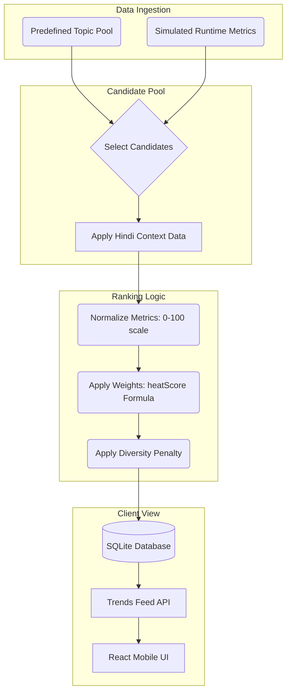
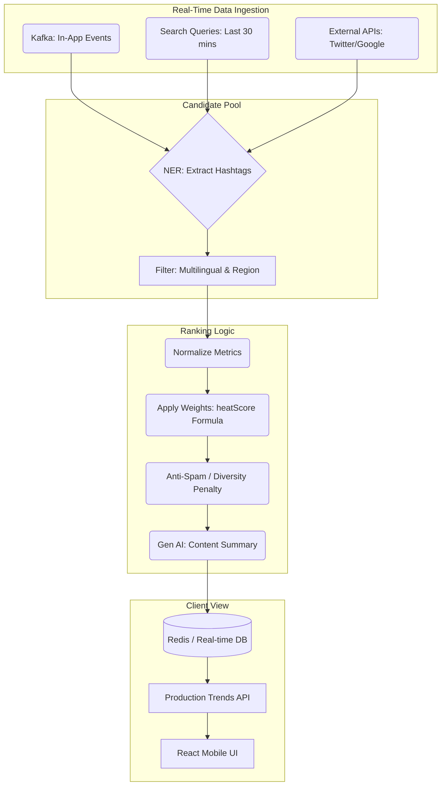

# ShareChat Trends Prototype

This repository contains an assignment-ready prototype for automated trending tags in Hindi, built as a sleek, mobile-first React SPA with a Python/SQLite backend.

## 1. How Our System Decides What's Trending

To ensure high-quality and dynamic trends, the system evaluates topics based on 14 rich metrics. Currently, these metrics are simulated dynamically at run-time to mimic real-time data flow for 40 pre-defined topical candidates.

### **The Signals & Weights**
Our algorithm relies on a highly composite `heatScore` calculated via the following components:

- **Base Engagement (20%)**: A weighted sum of cross-platform signals (YouTube, Google Trends, Twitter).
- **Spike Factor (15%)**: Real-time velocity proxy representing how fast the topic is growing on Twitter/X in the last hour.
- **DAU Clicks (15%) & Views (15%)**: Core in-app consumption metrics. 
- **Recency (10%)**: How fresh the topic is compared to yesterday's trends.
- **Search Volume (10%)**: The number of explicit search queries for this topic in the last 30 minutes.
- **Cross-Platform Prevalence (10%)**: A generalized score of the topic's reach on external news platforms.
- **Diversity Adjustment (5%)**: A penalty applied if too many topics from the exact same category (e.g., `sports`) are already trending, ensuring a balanced feed for the user.

*Note: The actual numerical generation is handled via randomization bounded by realistic limits, but the mathematical scoring pipeline reflects a production-grade ranking system.*

### **Filters**
- Only outputs Hindi-relevant tags tailored for the Indian demographic.
- Strict Category Cap: No more than a fixed number of trends from a single category can dominate the top 10.

---

## 2. Current Prototype Pipeline Diagram



---

## 3. UX Rationale

The user experience was designed strictly as a **mobile-native premium experience** rather than a simple web list view, optimizing for user engagement and clarity.

- **Dark Mode Aesthetic:** Matches the sleek, modern feel of high-end social and media applications, reducing eye strain and making gradient accents pop.
- **Visual Hierarchy in Feed:** Instead of just text, cards include explicit visual cues: Rank Badges, Category Chips, and real-time metrics (Heat, Views, Searches) via Lucide icons. This builds trust by showing the user *why* a topic is trending.
- **Immersive Detail View:** Tapping a trend smoothly transitions into a detail page with a sticky back-button header. 
- **The "AI Summary" Bonus:** The detail view prominently features a glassmorphic AI Summary card. By synthesizing the rich data metrics into a human-readable Hindi sentence, we save the user time and give them instant context.
- **Realistic Post Cards:** The related content mimics standard social media feeds (avatars, timestamps, engagement actions), making the prototype feel like a genuine app extension.

---

## 4. Future Roadmap

If given 4 more weeks to take this from prototype to production, I would prioritize:

1. **Replace Simulation with Real-Time Ingestion:**
   - Integrate Kafka/Kinesis streams to ingest actual ShareChat feed events (likes, views, shares).
   - Implement an NER (Named Entity Recognition) pipeline to organically discover and extract trending `#hashtags` from raw Hindi user posts in real-time, completely replacing the static `TOPIC_POOL`.
2. **Multilingual & Regional Personalization:**
   - Scale the pipeline to handle all 14+ Indian languages supported by ShareChat.
   - Introduce GPS/Location-based ranking boosts so users in Mumbai see different trends than users in Delhi.
3. **Generative AI Integration:**
   - Hook up a lightweight LLM (e.g., Llama 3 or Gemini Nano) to automatically generate the Hindi descriptions and "AI Summaries" based on the actual content of the trending posts.
4. **Anti-Spam & Moderation:**
   - Add a fast classification layer to filter out abuse, NSFW content, or inorganic bot-driven hashtag manipulation before scoring.

### Proposed Production Pipeline (After 4 Weeks)



---

## 5. Running Locally

1. Ensure Python 3.10+ is installed.
2. From the project root, run:
   ```bash
   python app.py
   ```
3. Open `http://localhost:8000` in your browser. The React frontend is bundled directly in the templates via CDN, requiring no Node/NPM build step!

## 6. Deployment

This application is currently deployed to Render at: https://sharechat-trends.onrender.com